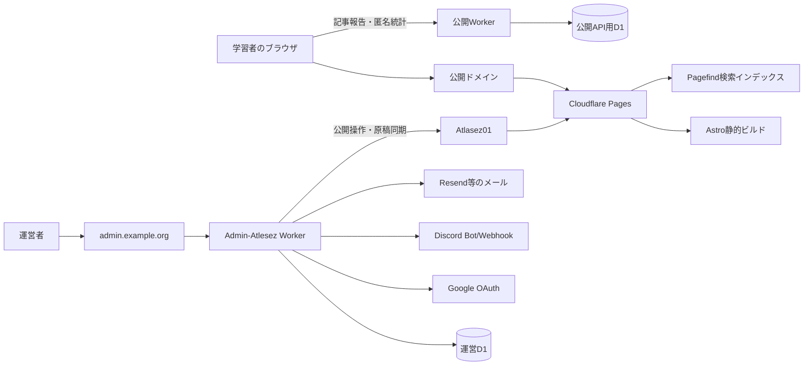

# Atlasez サイト構成・LLM作業・運用保守ガイド

最終更新: 2026-08-17
対象: `Atlasez/Atlasez01`（公式サイト・公開学習サイト）
関連: [`Atlasez/Admin-Atlesez`](https://github.com/Atlasez/Admin-Atlesez)（認証付き運営サイト）

この文書は、現在のリポジトリ分離後の構成を説明する正本です。過去のモノレポ時代に書かれた文書には、`src/pages/admin/`、`src/admin-worker.ts`、`wrangler.admin.jsonc`、`/admin/`を前提にした記述が残っています。それらは運営サイト側の履歴・設計資料として扱い、`Atlasez01`へ管理コードを戻さないでください。

## 1. まず結論

Atlasezは「公開するもの」と「運営者だけが扱うもの」を分けます。

| 境界           | 現在の正本                       | 公開範囲                 | 主な内容                                                                      |
| -------------- | -------------------------------- | ------------------------ | ----------------------------------------------------------------------------- |
| 公開リポジトリ | `Atlasez/Atlasez01`              | 公開または将来Private    | 公式サイト、学習サイト、公開記事、公開用Worker                                |
| 運営リポジトリ | `Atlasez/Admin-Atlesez`          | Private推奨              | Google OAuth、運営画面、ToDo、日程、査読、通知、D1運用データ、Discord Bot連携 |
| 公開ビルド     | `Atlasez01`のCloudflare Pages    | インターネット公開       | 静的HTML、CSS、JavaScript、検索インデックス                                   |
| 公開API        | `Atlasez01`のCloudflare Worker   | 必要なエンドポイントのみ | 記事報告、匿名記事統計、静的アセットへの入口                                  |
| 運用データ     | `Admin-Atlesez`側のCloudflare D1 | 運営者のみ               | 個人情報、査読、ToDo、日程、通知、同期状態                                    |

本番の基本的な経路は次のとおりです。



`Atlasez01`には、運営者のメールアドレス、Google subject、Discord ID、Bot token、OAuth secret、本番D1の内容を置きません。リポジトリがPrivateになっても、この原則は変わりません。

## 2. URLとサイト構造

### 2.1 現在の公開URL

本番URLはCloudflare Pages側の設定を正とします。GitHub Pagesは動作確認用ミラーです。

| 用途               | 現在の経路                             | 独自ドメイン取得後の例          |
| ------------------ | -------------------------------------- | ------------------------------- |
| 公式サイト         | `/`                                    | `https://atlasez.org/`          |
| 学習サイト入口     | `/atlas/`                              | `https://atlasez.org/atlas/`    |
| 学習サイト日本語   | `/atlas/ja/`                           | `https://atlasez.org/atlas/ja/` |
| 学習サイト英語     | `/atlas/en/`                           | `https://atlasez.org/atlas/en/` |
| 運営サイト         | Admin-Atlesezの別Worker                | `https://admin.atlasez.org/`    |
| GitHub Pagesミラー | `https://atlasez.github.io/Atlasez01/` | 本番URLと混同しない             |

公式サイトと学習サイトを`atlasez.org`配下に同居させる構成が最初の推奨です。`learn.atlasez.org`へ学習サイトを分ける場合は、ビルドを分けるか、内部リンク生成と`BASE_PATH`を見直してから行います。DNSだけを変更しても、Astroが生成するURLは自動では分離されません。

### 2.2 公式サイトのルート

```text
/                         ホーム
/about/                   Atlasezとは
/about/philosophy/        理念
/about/organization/      組織構成
/about/members/           運営メンバー
/about/history/           沿革
/projects/                プロジェクト一覧
/projects/<slug>/         プロジェクト詳細
/news/                    お知らせ一覧
/news/<slug>/             お知らせ詳細
/join/                    運営参加案内・外部応募フォーム
/contact/                 お問い合わせ
/privacy-policy/          プライバシーポリシー
```

### 2.3 学習サイトのルート

```text
/atlas/                                   言語選択または日本語入口へ案内
/atlas/<locale>/                          総合ホーム
/atlas/<locale>/<subject>/                分野トップ
/atlas/<locale>/<subject>/<category>/     カテゴリトップ
/atlas/<locale>/<subject>/<category>/<slug>/ 記事
/atlas/<locale>/map/                      学習地図
/atlas/<locale>/list/                     学習リスト
/atlas/<locale>/search/                   全文検索
/atlas/<locale>/guide/                    はじめての方へ
/atlas/graph.json                         概念グラフの公開JSON
```

ページファイルとURLの対応は`src/pages/`が正本です。URLを変更すると、記事間リンク、パンくず、学習地図、検索、外部リンク、Analyticsのキーに影響します。slugやlocaleを変更するときは、コード検索とビルド後の内部リンク検査を必ず行います。

### 2.4 運営サイトの境界

運営サイトは`Admin-Atlesez`で管理します。`Atlasez01`に運営用ページを追加しないでください。

運営サイト側の代表的な領域は次のとおりです。

```text
/admin/portal/                         メンバー用Home
/admin/atlas/                          学習サイト運営Home
/admin/articles/                       原稿・査読
/admin/editor/                         記事編集・コメント
/admin/operations/                     進捗・ToDo・日程
/admin/projects/<slug>/workspace/      プロジェクト別作業画面
```

これらの実装・D1 migration・認証・権限・通知・Discord同期を変更する場合は、`Admin-Atlesez`リポジトリで作業します。

## 3. ソースコードとデータの流れ

### 3.1 公開記事のビルド経路

```text
Markdown/YAML
  ↓ Astro content loader + Zod schema
src/content.config.ts
  ↓ getCollection / src/lib/content.ts
Astro pages under src/pages/atlas/
  ↓ Markdown processor
remark-math → rehypeRaw → legacy normalization → MathJax SVG
  ↓
dist/HTML + assets
  ↓ npm run search:index
dist/pagefind/
  ↓
Cloudflare Pages
```

- `status: published`の記事だけが公開ビルドに入ります。
- `draft`と`in-review`は検証対象に残りますが、本番公開対象から除外されます。
- `dist/`は生成物です。手編集・コミットしません。
- 数式は`remark-math`と`rehype-mathjax/svg`でビルド時にMathJax SVGになります。記事側の数式をHTMLへ手変換しないでください。
- 図・画像は`public/images/math/<article>/`へ保存し、記事本文の`figure`から相対`images/` URLで参照します。`alt`、レスポンシブ表示、出典を必須にし、外部画像やGoogle Sites iframeへ依存させません。
- 旧記事の`math`、`folding`、見出し属性は`astro.config.mjs`の正規化処理で後方互換を保っています。正規化を変更したら数学記事と折りたたみ証明のE2Eを確認します。

### 3.2 記事・概念・分野の関係

```text
subject（分野）
  └ category（カテゴリ）
       └ concept（言語非依存の永続概念ID）
            ├ prerequisites / recommendedNext / related
            └ article（言語別の説明記事）
```

保存単位と表示URLを混同しないでください。

| 用途                    | 例                             | 正本                                |
| ----------------------- | ------------------------------ | ----------------------------------- |
| 記事保存ディレクトリ    | `src/content/articles/jpn/...` | ISO 639-3（日本語`jpn`、英語`eng`） |
| 公開URLのlocale         | `/atlas/ja/`                   | UI互換の短縮コード（`ja`, `en`）    |
| 記事frontmatterのlocale | `locale: ja`                   | 公開URLと既存データの互換値         |
| 概念ID                  | `math.set-theory.sets`         | 公開後は変更しない永続ID            |
| 記事slug                | `sets`                         | URL用。変更時はリンク影響を調べる   |

概念グラフは`src/content/concepts/concepts.yaml`、分野とカテゴリは`src/content/subjects/subjects.yaml`、記事は`src/content/articles/<ISO 639-3>/`です。記事を追加するときは`npm run new:article`を起点にし、概念IDとカテゴリ定義を先に確認します。

### 3.3 学習地図と記事ページ

学習地図のデータは概念グラフから生成され、次のUIで共有されます。

- `src/components/LearningMap.astro`: グラフ描画、詳細パネル、経路検索、表示状態、モバイル操作
- `src/pages/atlas/graph.json.ts`: グラフJSONの入口
- `src/lib/graph.ts`: 概念グラフの変換、循環や経路の前提
- `src/lib/content.ts`: 概念と記事の対応、前提記事、関連記事、翻訳記事
- `src/pages/atlas/[locale]/...`: タイル、地図、リスト、記事のURL経路

学習地図を変更したときは、少なくとも「総合ホーム→分野選択→タイル/地図/リスト」「カテゴリ→記事」「経路検索」「スマートフォン」の4経路を確認します。URLの状態を`history.pushState`等で持つ場合は、戻る・更新・直接アクセスもテストします。

### 3.4 ブラウザ内データと公開API

学習リスト、あとで読む、学習記録、表示設定は原則としてブラウザ内に保存します。現状は読者アカウントや端末間同期を前提にしません。これらをサーバー保存へ変更する場合は、同意、削除、エクスポート、匿名化、認証を先に設計します。

`src/worker.ts`は公開側のAPI入口です。

| API                           | 用途                    | 保存先・注意                                      |
| ----------------------------- | ----------------------- | ------------------------------------------------- |
| `POST /api/article-reports`   | 記事の問題報告          | 公開側D1。入力検証・レート制限・必要最小限の通知  |
| `POST /api/article-analytics` | 匿名の閲覧/読了イベント | localeをISO 639-3へ正規化。個人追跡を目的にしない |
| その他                        | 静的アセット            | `ASSETS`へ委譲                                    |

記事報告のDiscord通知に使うWebhookやIPハッシュ用ソルトはCloudflare Secretです。公開WorkerにDiscord Bot tokenを置きません。運営サイトのDiscord Bot・ロール同期・チャンネル同期は`Admin-Atlesez`側です。

## 4. LLMが読む順序と調査経路

### 4.1 読む順序

LLMや自動化エージェントへ作業を依頼するときは、最初からリポジトリ全体を無差別に読み込ませません。次の順で必要な範囲だけを渡します。

1. ルートの`AGENTS.md`: 変更・秘密情報・migration・テスト・Claude連携の規則
2. この文書: 現在のリポジトリ境界、URL経路、公開/運営データの責任範囲
3. `docs/DEVELOPMENT_GUIDE.md`: 開発規則と検証コマンド（古い運営パスの記述は本書で補正）
4. 目的に応じた正本:
   - 記事: `docs/ADDING_ARTICLES.md`, `docs/CONTENT_MODEL.md`
   - 学習地図: `docs/CONCEPT_GRAPH.md`, `docs/INFORMATION_ARCHITECTURE.md`
   - UI: `docs/DESIGN_DECISIONS.md`, `docs/ACCESSIBILITY.md`
   - 公開: `docs/PUBLISH.md`, `docs/DEPLOYMENT.md`
   - 境界: `docs/REPOSITORY_BOUNDARIES.md`
5. 対象コード・対象テスト・必要なデータだけを検索

`Admin-Atlesez`の作業では、同リポジトリの`AGENTS.md`とこの文書の境界説明を参照し、Admin側のコード・migration・Secretを`Atlasez01`へコピーしません。

### 4.2 LLMへの依頼テンプレート

依頼文には、対象、目的、非対象、データ境界、確認方法を明記します。

```text
対象リポジトリ: Atlasez/Atlasez01
対象サイト: 公式サイト / 学習サイト / 公開Worker のいずれか
目的: 何を利用者にどう見せたいか
対象ファイル: 具体的なファイルまたは検索語
触らない: Admin-Atlesez、認証、D1、記事本文など
データ境界: 個人情報・Secret・本番D1は読み出さない
経路: 影響するURL、locale、slug、API、学習地図の状態
確認: check / lint / format / unit / build / E2E / link検査
完了条件: 期待URL、表示状態、レスポンシブ幅、アクセシビリティ
```

### 4.3 調査コマンドの基本

```bash
git status --short --branch
rg -n "検索語" src docs tests scripts package.json
rg --files src/pages src/components src/lib tests
git diff --check
```

ルーティングを調べるときは、次の順に追います。

```text
src/pages/...                 URLとサーバー描画
  → src/lib/site.ts/i18n.ts   URL・locale・表示ラベル
  → src/lib/content.ts/graph.ts データ導出
  → components/layouts        UI・状態・共通CSS
  → src/styles/               トークン・レスポンシブ
  → tests/e2e と tests/unit    利用者経路と純粋ロジック
```

Claudeなどの副担当には、ファイル変更なしの独立レビューを依頼するのが基本です。Codex/主担当が実コード・既存仕様・テスト結果と照合し、採用する指摘だけを実装します。広い監査や複雑なstate/routingの調査はbackgroundのplanモードで実施し、同じ調査を重複起動しません。

### 4.4 LLMがしてはいけないこと

- `dist/`、`node_modules/`、生成されたPagefindファイルを手編集する
- `git reset --hard`や広い範囲の削除で他人の変更を消す
- `.env`、Cloudflare Secret、本番D1、個人メール、Discord tokenを読む・出力する
- `src/pages/admin/`など過去の管理コードをこのリポジトリへ復活させる
- 記事slug、概念ID、言語保存ディレクトリを影響調査なしで変更する
- UIだけで権限を隠し、API側の認証・認可を省略する（Admin側の作業で特に注意）
- 「ビルドが通った」だけで、学習地図・スマホ・リンク・アクセシビリティを未確認のまま完了する

## 5. 変更種類別の保守手順

### 5.1 記事・お知らせ・プロジェクト

1. `npm run new:article`または既存の正しいファイルを起点にする
2. frontmatterのschema、`status`、`concepts`、`subject/category`を確認
3. 数式・定義枠・折りたたみ・リンクをプレビューで確認
4. `npm run validate:content`、`npm run audit:math`、ビルド、内部リンク検査
5. PRで本文差分と公開範囲をレビュー

公開記事に個人の連絡先を査読者名として書かず、団体の編集者名・役割名など、公開してよい識別子を使います。

### 5.2 UI・CSS・ルーティング

共通UIは既存コンポーネントとデザイントークンを優先します。ページに局所CSSを追加する前に、`src/styles/tokens.css`、`src/styles/base.css`、該当layout/componentを確認します。

確認幅の目安:

```text
スマホ: 390px前後
タブレット: 768px前後
PC: 1280px前後
```

UI変更では、キーボード操作、フォーカス、aria-label、コントラスト、長い日本語、数式、折りたたみ、リンクの実遷移を確認します。

### 5.3 学習地図・概念グラフ

概念IDを削除・改名しないことが最優先です。関係を変更したら、循環、孤立ノード、記事への対応、前提/次に読む/関連の重複を検査します。地図のUIだけを直してデータを合わせない、またはデータだけを直してリストと記事リンクを確認しない、という片側修正を避けます。

### 5.4 公開Worker・API

入力の長さ・型・許可値・Origin・レート制限・エラー応答を確認します。個人情報や本文をDiscordへ送らない設計を維持します。環境変数名だけをコードと文書に書き、Secretの値はCloudflare Dashboardで登録します。

Workerコード、binding、D1 schemaを変更した場合は、次を個別に記録します。

- 既存データとの互換性
- migration番号と適用順
- remote適用の担当者
- ロールバック方法
- Secret/環境変数の追加・変更
- CORS、OAuth、独自ドメインへの影響

### 5.5 Admin-Atlesez側の変更

運営サイトのToDo、複数リマインダー、メール通知、進捗、日程、Google OAuth、Discord同期、D1 migrationはAdmin-Atlesezで実装します。公開側の`Atlasez01`には管理画面、管理API、運用D1データを追加しません。

記事の公開経路をAdmin側から変更する場合は、次の境界を確認します。

```text
Admin-Atlesezの認証・編集・査読
  → 公開可能な記事データ/PR
  → Atlasez01のCI
  → main
  → Cloudflare Pages
```

## 6. 検証コマンドと実行順

通常の変更では、少なくとも次を実行します。

```bash
npm run check
npm run lint
npm run format:check
npm test -- --run
npm run build
git diff --check
```

UI、学習地図、記事組版、URL、アクセシビリティを変更した場合は追加します。

```bash
npm run test:e2e
npm run validate:content
npm run audit:math
node scripts/check-links.mjs dist /
```

注意:

- `npm run validate:content`は内部でAstro buildを実行するため、Pagefindを再生成する最終確認では、検証後に`npm run build`をもう一度実行します。
- `npm run test:e2e`は、通常ビルド済みの`dist/`とローカルサーバーを前提にします。
- CIの`ci.yml`は検証用です。Cloudflare Pagesの本番デプロイとは別に動きます。
- テストを省略した場合は、理由と未確認範囲をPR本文に残します。

## 7. GitHub・Cloudflare・独自ドメイン

### 7.1 通常の公開経路

1. feature branchで変更
2. PRを作成
3. GitHub Actionsでschema、数式、型、lint、format、unit、build、リンク、E2E/axeを確認
4. `main`へマージ
5. Cloudflare Pagesが`main`をビルドして本番へ反映
6. 公開URL、robots、sitemap、主要ページを確認

GitHub Pagesの`deploy-pages.yml`は動作確認用ミラーです。本番と同一視しません。リポジトリをPrivateにする場合、Cloudflare GitHub AppにPrivateリポジトリへのアクセスを再確認します。GitHub PagesのPrivateリポジトリ利用可否はGitHubのプランに依存するため、Cloudflare Pagesを本番の正本にして、不要ならGitHub Pagesミラーを停止します。

ミラーを維持する場合は、`deploy-pages.yml`の`SITE_URL`、`BASE_PATH`、`NOINDEX=1`を実際のGitHub Pages URLと一致させます。組織移行前のユーザー名をcanonical URLに残さず、ミラーを検索エンジンへ登録させないことが重要です。Private化とCloudflare Pages一本化を行う場合は、GitHub Pages workflow・Pages設定・不要なCORS許可Originを同じPRで整理します。

Cloudflare PagesのGit連携では、同じリポジトリを複数のCloudflareアカウントのPagesプロジェクトへ同時接続できません。個人アカウントからAtlasez用アカウントへ移す場合は、GitHub Appの接続、Pagesプロジェクト、カスタムドメイン、環境変数、Worker/D1 bindingを順に確認します。

### 7.2 独自ドメイン

推奨構成:

```text
atlasez.org          公式サイト・学習サイト
admin.atlasez.org    Admin-Atlesezの運営サイト
```

Pages側のProduction環境に`SITE_URL=https://atlasez.org`を設定し、ルート配信では`BASE_PATH=/`を使います。Admin-Atlesez側のURLを`ADMIN_ORIGIN`などへ登録し、Google OAuthのredirect URI、CORS、Cookie、通知リンクも更新します。DNSのレコード値はCloudflareが表示する値を使い、推測で設定しません。

### 7.3 Discord・OAuth・メール

ドメイン変更だけでDiscordサーバーやBotが消えることはありません。ただしCloudflareアカウントやWorkerを移す場合は、Secretを新環境へ再登録します。

| 連携                         | 保持場所                  | 移行時の確認                                   |
| ---------------------------- | ------------------------- | ---------------------------------------------- |
| 記事報告Webhook              | 公開WorkerのSecret        | Webhook再登録、投稿先、個人情報を送らないこと  |
| Bot/ロール/チャンネル同期    | Admin-AtlesezのSecretとD1 | Bot token、Guild/Channel/Role ID、権限         |
| Google OAuth                 | Admin-Atlesez             | client ID/secret、redirect URI、許可ドメイン   |
| 応募・リマインダー等のメール | Admin-Atlesez             | Resend API key、送信元ドメイン、SPF/DKIM/DMARC |
| 記事匿名統計                 | 公開Worker/D1             | `jpn`等のISO 639-3正規化、既存集計キーの移行   |

Secretの値をGitHub issue、PR、LLM、スクリーンショットへ貼りません。漏えいした場合はコードから削除するだけでなく、直ちに失効・再発行します。

`wrangler.jsonc`や文書に、現在のWorkerコードが読まない旧連携変数が残っていないか、アカウント移行前に確認します。設定に名前があるだけで連携が動くとは限りません。実際に`src/worker.ts`の`Env`、デプロイ設定、Cloudflare DashboardのSecret/Variable、D1 bindingを突き合わせます。

### 7.4 Google検索の統計（Search Console）

Google検索からの流入を測る場合は、[Google Search Console](https://search.google.com/search-console/about)を使います。Search Consoleの[検索パフォーマンス](https://support.google.com/webmasters/answer/7576553)では、検索語・ページ・国などの単位で、クリック数、表示回数、CTR、平均掲載順位を確認できます。これはブラウザへGoogle AnalyticsのJavaScriptを追加する仕組みではなく、検索結果上でのサイトの見え方を測る仕組みです。

#### 取得する統計の役割分担

| 目的                           | 使うもの                | 分かること                                                |
| ------------------------------ | ----------------------- | --------------------------------------------------------- |
| Google検索で見つかったか       | Google Search Console   | 検索語、表示回数、クリック、CTR、平均掲載順位、ページ、国 |
| サイト内で何をしたか           | 既存の匿名記事統計      | 記事の閲覧、熟読、読了などのサイト内イベント              |
| 流入元とサイト内行動を広く見る | GA4（導入する場合のみ） | セッション、参照元、イベント、コンバージョン              |

Search Consoleのデータは、まずSearch Consoleの管理画面で見る構成を推奨します。運営サイトに検索語や掲載順位を表示する必要が出た場合だけ、Google Search Console APIを`Admin-Atlesez`側へ追加します。Google OAuth、API token、検索クエリの集計結果を公開リポジトリや公開Workerへ持ち込まないでください。

#### 初回設定（独自ドメイン確定後）

1. 本番ドメインを決める（例: `atlasez.org`）。`www`を使うか、公式サイトと学習サイトを同一ドメイン配下に置くかもこの時点で固定する。
2. Cloudflare PagesのProduction環境へ`SITE_URL=https://atlasez.org`、`BASE_PATH=/`を設定する。
3. Google Search ConsoleでDomain property（例: `atlasez.org`）を追加し、[所有権確認](https://support.google.com/webmasters/answer/9008080)に表示されたDNS TXTレコードをCloudflare DNSへ登録する。URL-prefix propertyを使う場合は、`https://`、`www`の有無、パスを正確に一致させる。
4. 本番の`https://atlasez.org/robots.txt`を開き、`Sitemap: https://atlasez.org/sitemap-index.xml`が出ていることを確認する。
5. Search ConsoleのSitemapsへ`https://atlasez.org/sitemap-index.xml`を登録する。
6. `NOINDEX=1`のミラーやPreview URLを本番propertyとして登録しない。本番の`main`ビルドに`noindex`が残っていないことを確認する。
7. Search Consoleのユーザー権限を個人アカウントへ直接集約せず、団体の管理用Googleアカウントを所有者にして必要なメンバーだけを追加する。

Search Consoleは所有権確認後すぐに過去データが揃うとは限らず、サイトがGoogleに認識・クロールされてから表示されます。独自ドメインを変更した場合は、旧propertyを消すのではなく、新property、canonical、sitemap、主要URLのインデックス状況を確認してから移行します。

#### 運用時の確認

- 月1回、検索パフォーマンスを「検索語」「ページ」「国」で分け、表示回数が多いのにCTRが低いページと、掲載順位が改善しているページを確認する。
- `インデックス登録`、`ページ`、`サイトマップ`のエラーを確認する。404、重複canonical、意図しないnoindexは公開経路の変更後に重点確認する。
- 学習記事のタイトル、description、見出し、内部リンクを変更する場合は、検索結果のクリック率と記事内の匿名統計を別々に見る。
- Search Consoleからダウンロードした検索語・ページ別データは、個人情報や機密情報が混ざる可能性を考慮し、GitHub issue、PR、LLMの入力、公開D1へ保存しない。

Search Consoleの検索パフォーマンスは検索結果の統計であり、訪問者の同意管理やサイト内行動の計測を代替しません。GA4を追加する場合は、目的、Cookie/同意、プライバシーポリシー、データ保持期間、管理者権限を別途決めてから実装します。

## 8. 障害対応の入口

### ビルドが失敗する

1. GitHub Actionsの失敗stepを特定
2. `npm run check`、`npm run validate:content`、`npm run audit:math`をローカル再現
3. schema違反ならfrontmatter、リンクならslug/locale/base pathを確認
4. `dist/`を手修正せず、ソースを直して再ビルド

### 公開ページが404になる

1. Pagesのデプロイ対象branchが`main`か確認
2. `SITE_URL`と`BASE_PATH`の組み合わせを確認
3. `trailingSlash`を含む実URLを確認
4. Cloudflare Pagesの最新デプロイとcustom domainの状態を確認
5. `node scripts/check-links.mjs dist /`を実行

### 公開APIが失敗する

1. ブラウザ側のOriginとWorkerの許可Originを確認
2. payloadの必須項目・サイズ・許可値を確認
3. WorkerのSecret・D1 binding・migration適用状態を確認
4. Discord/メール通知の失敗と、D1保存の失敗を分けて確認
5. Secretの値をログへ出さない

### 数式・証明枠・リンクが崩れる

1. Markdownの元表記を確認
2. `astro.config.mjs`のremark/rehype順序を確認
3. MathJax SVGが生成されているか確認
4. `folding`、`details`、`summary`、定義枠の境界を記事HTMLで確認
5. 数学E2Eと対象記事のPC/スマホ表示を確認

### 学習地図からの遷移が崩れる

1. `subject/category/concept/article`の識別子を確認
2. 地図のURL stateとブラウザ履歴を確認
3. タイル・リスト・地図・記事の4方向遷移を確認
4. 直接URL、更新、戻る、言語切替を確認

## 9. 現時点の監査で確認した保留事項

この文書は構成と保守の入口ですが、既存コードや過去の移行記録をすべて同時に書き換えたものではありません。次の項目は、現状を誤って「対応済み」と判断しないために明記します。

### 9.1 GitHub Pagesミラーの検索制御

`.github/workflows/deploy-pages.yml`は現在もGitHub Pagesへ配信するworkflowです。一方、workflowのビルド環境には現時点で`NOINDEX=1`が明示されておらず、`SITE_URL`も組織移行前の値になっています。`src/lib/deploy.ts`は`SITE_URL`があるビルドを本番扱いできるため、ミラーを維持する間は次のいずれかを同じPRで実施します。

- ミラーを廃止する: workflow、Pages設定、不要な許可Origin・canonical参照を整理する
- ミラーを維持する: 実際のPages URLに`SITE_URL`と`BASE_PATH`を合わせ、`NOINDEX=1`を渡し、`robots.txt`・canonical・sitemapを確認する

Cloudflare Pagesを唯一の公開先にしてリポジトリをPrivate化する場合は、先にCloudflare GitHub Appの再認可とPagesのデプロイを確認し、GitHub Pagesを公開経路として残さないことを確認します。

### 9.2 匿名記事統計のD1 schema

`src/worker.ts`には`article_analytics_daily`へのupsert処理がありますが、現行リポジトリの`migrations/`にはそのテーブルを作成するmigrationが見当たりません。既存本番D1を直接調査・変更するのではなく、管理者がCloudflare側の実schemaと適用履歴を確認し、環境再構築が必要になる前に新しい連番migrationとしてschemaを管理下へ戻します。統計機能を変更する場合は、個人を識別する値を保存しないこと、集計キーの互換性、既存データの扱いをレビューします。

### 9.3 古い運用文書とプライバシー記載

`docs/DEPLOYMENT.md`、`docs/PUBLISH.md`、`docs/ADMIN_GUIDE.md`などには、分離前の`/admin`、管理Worker、GitHub Pages運用を前提にした説明が残っています。現在の実装境界は本書とコードを優先し、管理画面の手順は`Admin-Atlesez`側で更新します。公開Workerの匿名統計・記事報告・外部サービス処理が現行プライバシーポリシーに反映されているかも、公開設定や機能追加の前に確認します。

これらは本書追加だけでは解消しない保留事項です。解消したPRでは、該当箇所のコード・設定・D1適用結果・公開URLをセットで記録し、本節を更新または削除します。

## 10. ドキュメントを維持するルール

次の変更を行ったときは、この文書も同じPRで更新します。

- リポジトリ境界、公開/運営の責任範囲を変えた
- URL、locale、slug、ドメイン、Pages/Workerを変えた
- 新しいSecret、外部サービス、D1 bindingを追加した
- 記事のschema、概念グラフ、MathJax/Folding処理を変えた
- CI、デプロイ、ロールバック手順を変えた
- LLMの読み込み順やサブエージェントの権限方針を変えた

現在の仕様の優先順位は次のとおりです。

1. 実行されるコードとschema
2. `AGENTS.md`
3. 本文書
4. 対象機能の個別ドキュメント
5. 古い移行記録・提案書

個別文書とコードが矛盾した場合は、勝手に片方へ合わせず、実コードの挙動を確認してから文書を更新します。特に、管理サイト分離前の`/admin`や`wrangler.admin.jsonc`の記述は、現在の`Atlasez01`の実装を示すものではありません。

## 11. 最終チェックリスト

```text
[ ] git statusで既存変更を確認した
[ ] 対象サイトと非対象サイトをPRに書いた
[ ] Admin-Atlesezのコード・D1・Secretを公開リポジトリへ持ち込んでいない
[ ] 記事の保存localeはISO 639-3ディレクトリになっている
[ ] 概念ID・slug・URLへの影響を調べた
[ ] 個人情報・Secret・本番D1データが差分にない
[ ] dist/を手編集していない
[ ] check / lint / format / unit / buildを実行した
[ ] UI変更ならE2E・axe・PC/スマホ表示を確認した
[ ] link / content / math検査を必要に応じて実行した
[ ] PR本文に変更範囲・テスト・未解決の制約を書いた
[ ] main反映後に公開URLと主要経路を確認した
```
